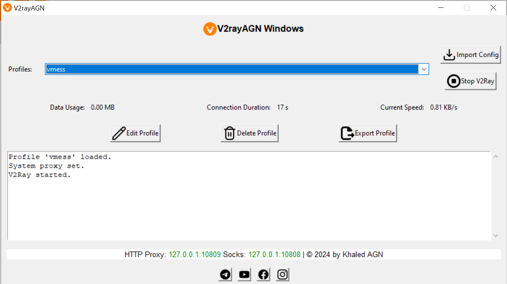

## V2rayAGN - V2Ray Configuration Manager
V2rayAGN is a GUI-based application designed to manage V2Ray configurations on Windows. It provides an intuitive interface for importing, exporting, editing, and managing V2Ray profiles, making it easy to configure and control your V2Ray proxy service.

## Android Client App: V2rayAGN
<p>
<a href="https://play.google.com/store/apps/details?id=com.agn.v2ray"></a>
</p>

## Features
* Import Configurations:
  Import V2Ray configurations from clipboard or file.

* Export Configurations:
  Export V2Ray configurations to a file.

* Edit Profiles:
   Edit existing V2Ray profiles.

* Delete Profiles:
   Remove unwanted V2Ray profiles.

* Start/Stop V2Ray Service:
   Control the V2Ray service with a simple button click.

* View Statistics:
  Monitor data usage, connection duration, and current speed.

* System Proxy Management:
   Automatically set and clear the system proxy settings.

## Prerequisites
* Windows 7, 8, 10, or 11
* Python 3.x
* Required Python packages: tkinter, PIL, pyperclip, psutil, sqlite3


# Installation and Usage
Step 1: Clone the Repository
Clone the V2rayAGN repository to your local machine.

```
git clone https://github.com/khaledagn/V2rayAGN-Windows.git
cd V2rayAGN
```
Step 2: Install Dependencies
Ensure you have Python 3.x installed. Install the required Python packages using pip.

```
pip install -r requirements.txt
```
Step 3: Run the Application
Run the main Python script to start the V2rayAGN application.

```
python main.py
```
Building the Executable
To create a standalone executable that can run without Python installed:

Install PyInstaller:

```
pip install pyinstaller
```
Generate the Executable:

Use the following PyInstaller command to package the application:

```
pyinstaller -w -F -i "resources/img/app_icon.ico"  --add-data "core;core" --add-data "resources;resources" --add-data "database;database" main.py
```
This command will create an executable in the dist directory.

## Detailed Explanation of Features

* Importing Configurations: You can import V2Ray configurations from the clipboard or a file. The application supports V2Ray URL formats like vmess://, vless://, trojan://, and ss://.

* Exporting Configurations : Export V2Ray configurations to a .v2agn file. The file contains the configuration URL encoded in Base64 format, making it easy to share and import on other devices.

* Editing and Deleting Profiles : Edit the JSON configuration of existing profiles or delete profiles that are no longer needed.

* Starting and Stopping V2Ray Service : Control the V2Ray service directly from the application. The service runs in the background, and you can monitor its status and statistics.

* System Proxy Management
V2rayAGN can automatically set and clear the system proxy settings, ensuring your traffic is routed through the V2Ray proxy.

## Screenshots



## Support and Maintenance
This project is maintained by Khaled AGN. For updates and support, visit:

<ul>
 <li>TELEGRAM CHANNEL: https://t.me/khaledagn</li>
 <li>FACEBOOK: https://www.facebook.com/itskhaledagn</li>
 <li>INSTAGRAM: https://www.instagram.com/khaledagn</li>
 <li>TWITTER: https://www.twitter.com/khaled_agn</li>
 
 </ul>

## Thanks to :

<ul>
 <li>arminmokri: https://github.com/arminmokri/v2ray2json/blob/main/v2ray2json.py</li>
 <li>v2fly: https://github.com/v2fly/v2ray-core</li>
 </ul>
